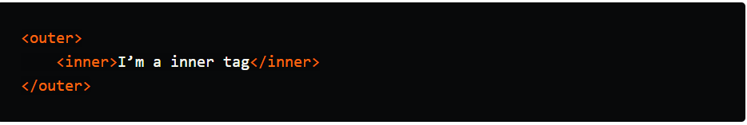
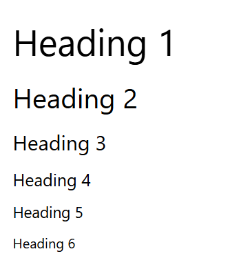
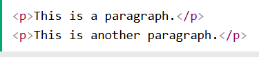
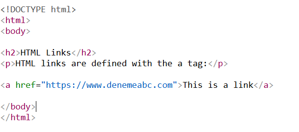
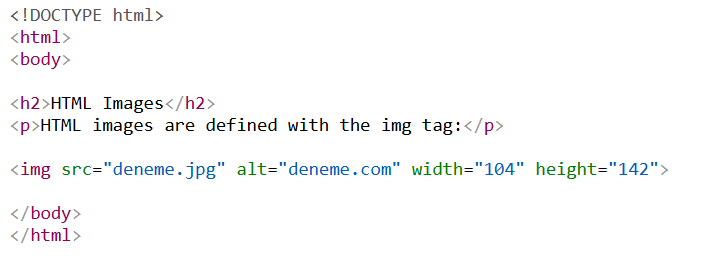
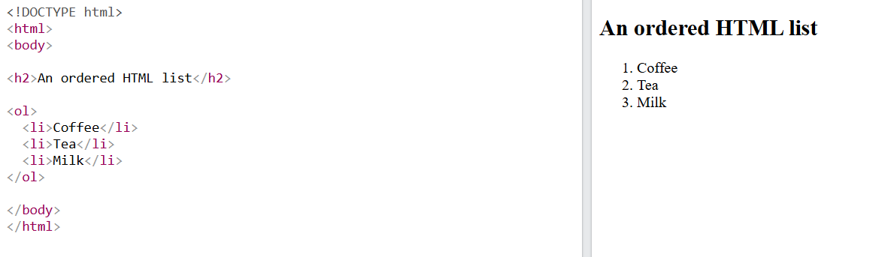
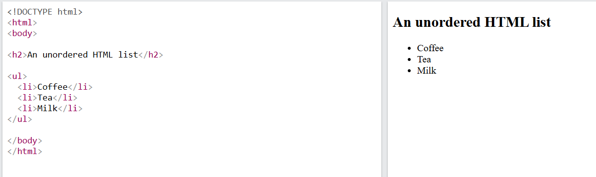
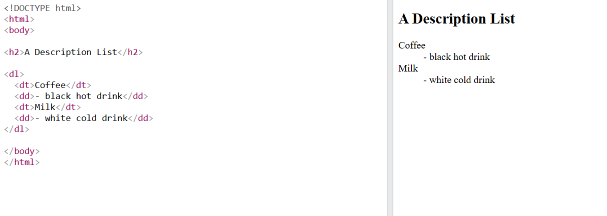

# HTML ANATOMİSİ 

## HTML NEDİR? 

*HTML, web sayfaları oluşturmak için kullanılan standart işaretleme dilidir. HTML'in açılımı  Hyper Text Markup Language 'dir.İlk HTML dili, 1990 yılında Tim Berners-Lee tarafından geliştirilmiştir.HTML bir web sayfasının yapısını(iskeletini) tanımlar. HTML öğeleri ise tarayıcıya içeriğin nasıl görüntüleneceğini söyler.HTML bir proglamlama dili değildir, çünkü derleyiciye ihtiyaç duymaz.Bu nedenle etiket isimleri yanlış yazılsa dahi HTML sayfasında hata vermeden çalışır ve görüntülenir ama oluşturmak istenen görüntü tarayıcıda farklı görünebilir.* 

## HTML ETİKETİ NEDİR ?

*Sayfa üzerinde kullanılan her öğeye HTML etiketi denir.HTML'de etiketler genellikle çiftler halinde gelir: açılış etiketleri ve kapanış etiketleri. Açılış etiketleri bir "<", bir kelime ve ardından bir ">" işaretinden oluşur. Kapanış etiketleri ise kelimenin önünde bir "/" işaretiyle biraz farklıdır.Etiketler birbirlerinin içine yerleştirilebilir. Aşağıda bir etiket örneği bulunmaktadır.*

⚠️  Bazı HTML öğelerinin içeriği yoktur (` ` öğesi gibi). Bu öğelere boş öğeler denir. Boş öğelerin bitiş etiketi yoktur!

**Etiket kullanımı şu şekildedir:**

`<etiket_ismi>` Açılış ve kapanış etiketleri arasına sayfa öğeleri eklenir ve etiketin görevi ne ise içinde bulunan öğeye o görevi uygular.`<\etiket_ismi>`

**Aşağıda örnek bir HTML anatomisinin örneği bulunmaktadır.Bu görsel, bir HTML belgesinin temel anatomisini göstermektedir.**

**Bu yapıları kısaca özetleyecek olursak :**

**`<!DOCTYPE>` Öğesi**: *Bu öğe belge türünü temsil eder ve tarayıcıların web sayfalarını doğru şekilde görüntülemelerine yardımcı olur.Yalnızca bir kez sayfanın en üstünde(HTML etiketlerinden önce)görünür.Büyük/küçük harf duyarlılığı yoktur.Belge, '<!DOCTYPE html>' ile başlar ve `<html>` etiketi ile kapsanır.`<html>` etiketi etiket kök öğe görevi görür, bu nedenle diğer tüm etiketler onun içine yerleştirilir.*

**`<head>` Öğesi**: *Bu öğe HTML sayfasıyla ilgili meta bilgiler içerir.`<head>` etiketi web sayfası hakkında tarayıcıya bilgi verir.Bu bölümde sayfanın başlığı (`<title>`), karakter seti (`<meta charset="UTF-8">`),stil dosyaları (CSS) ve script dosyaları yer alabilir. 
Ayrıca SEO ve sayfa ayarları için kullanılan meta etiketleri de burada bulunur.*

** `<body>` Öğesi**: *Bu öğe, belgenin gövdesini tanımlar ve başlıklar(`<h1>` - `<h6>`), paragraflar(`
`), resimler(``), bağlantılar (`<a>`) , tablolar, listeler vb. gibi tüm görünür içerikleri kapsayan bir öğedir.Kullanıcı, tarayıcıda gördüğü her şeyi bu bölüm sayesinde görüntüler.*

## HTML Başlıkları ##

**`<title>` Başlık  etiketi** : *HTML dokümanlarının başlık bölümünde yer alan en önemli yapısal unsurlardan biridir. Bu etiket, sayfanın ana başlığını belirler ve genellikle `<head>` bölümünde kullanılır. Tarayıcılar ve arama motorları, bu etiketi kullanarak sayfa hakkında bilgi edinir ve sayfanın konusu veya içeriği hakkında özet bilgi sağlar. Ayrıca, başlık etiketi, kullanıcıların tarayıcı sekmesinde veya yer imlerinde sayfayı tanımlamalarına da olanak tanır. Bu nedenle, başlık etiketi hem kullanıcı deneyimini iyileştirir hem de SEO açısından kritik öneme sahiptir.*

> *Başlık etiketleri, sayfa içeriğinin ana ve alt bölümlerini belirlemek için kullanılır ve genellikle `<h1>` ile `<h6>` arasında sıralanır. En önemli başlık, `<h1>` etiketiyle belirtilir ve sayfa içeriğinin ana konusu üzerinde vurgu yapar. Aşağıda `<h1>`-`<h6>`nın kıyas yapıldığı tablo bulunmaktadır.*

| Etiket | Görünüm Örneği | Önem Seviyesi | Kullanım Amacı |
| :--- | :--- | :--- | :--- |
| `<h1>` | # Başlık 1 | **En Yüksek** | Sayfanın ana başlığı (Sayfada sadece 1 tane olmalı) |
| `<h2>` | ## Başlık 2 | **Yüksek** | Ana bölümler ve ana kategoriler |
| `<h3>` | ### Başlık 3 | **Orta** | Alt başlıklar ve konu detayları |
| `<h4>` | #### Başlık 4 | **Düşük** | Daha küçük alt başlıklar |
| `<h5>` | ##### Başlık 5 | **Çok Düşük** | Nadir kullanılan alt detaylar |
| `<h6>` | ###### Başlık 6 | **En Düşük** | En küçük teknik başlık seviyesi |

**`
` Paragraf Etiketi** : *Paragraf etiketi (`
`) Web sayfalarında metinleri yapılandırmak ve düzenlemek amacıyla kullanılan temel HTML etiketlerinden biridir. Metinleri anlamlı parçalara ayırmak ve görsel olarak düzenlemek için ideal bir araçtır. Bu etiket, içerdiği metne belirli stil ve biçimlendirmeler uygulamaya olanak sağlar ve sayfa içeriğinin okunabilirliğini artırır. Bir paragraf başlatmak için `
` etiketi kullanılır ve paragraf bitiminde kapanış etiketi olan `
` ile sonlandırılır. Bu yapı, tarayıcıların ve arama motorlarının sayfa içeriğini doğru şekilde anlamasına yardımcı olur. Ayrıca,`
` etiketi içinde bulunan metinler üzerinde CSS ile stil uygulamak, font, renk, satır aralığı gibi görsel düzenlemeleri yapabilmeyi sağlar.* 

**`<a>` Bağlantı Etiketi** : *`<a>` etiketi, HTML’de en temel ve yaygın kullanılan bağlantı oluşturma aracıdır. Bağlantının tanımı ve kullanımı açısından `<a>` etiketi, HTML’nin navigasyon ve içerik erişilebilirliği açısından kritik bir unsurdur. Bu etikette, `href` nitelği, bağlantının gideceği adresi belirtir ve bu adres web sayfası, dosya yolu veya e-posta adresi olabilir. Ayrıca, bağlantıya tıklayan kullanıcıya gösterilecek olan metin veya görsel öğe, etikette tanımlanan içeriğe yerleştirilir.*

**`` Görsel Etiketi** : *HTML’de görselleri sayfaya eklemek ve düzenlemek amacıyla kullanılan `` etiketi, kullanıcıların görsel içeriklerle sayfalar oluşturmalarına olanak tanır. Bu etiket, boş (self-closing) bir etikettir ve genellikle iki temel özelliği içerir: src ve alt. src özelliği, görüntünün yer aldığı dosyanın konumunu belirtirken, alt özelliği ise görsel görüntüleyicilere veya ekran okuyucu kullanıcılara, görsel içeriğin ne olduğunu anlatan alternatif metni sağlar.*

### HTML' DE LİSTE YAPISI 

> *HTML listeleri, web sayfalarında içeriklerin düzenlenmesini ve görüntülenmesini kolaylaştıran önemli yapılardır. Listeler, sıralı ve sırasız olmak üzere 2'ye ayrılır.*

> *Sıralı listeler (`<ol>`) anlam sıralamasını göstermek için kullanılır ve her bir öğe, `<li>` etiketi ile tanımlanır. Bu liste türü, adım adım talimatlar, sıralanmış veriler veya derecelendirmeler gibi düzenli sıra gerektiren içerikler için idealdir.*

> *Sırasız listeler (`<ul>`), genellikle maddi veya kategorik bilgilerin listelenmesinde kullanılır ve genellikle madde işaretleri ile gösterilir. Her öğe yine `<li>` etiketleriyle belirtilir. Bu tür liste, genel bilgiler, özellik listeleri veya seçim seçenekleri gibi içerikleri düzenlemek için uygundur.*

>*Tanım listeleri (`<dl>`), terim ve tanım şeklinde düzenlenen içerikler için tercih edilir. Bu listede, terimler `<dt>` etiketiyle, açıklamalar ise `<dd>` etiketiyle belirtilir.*

